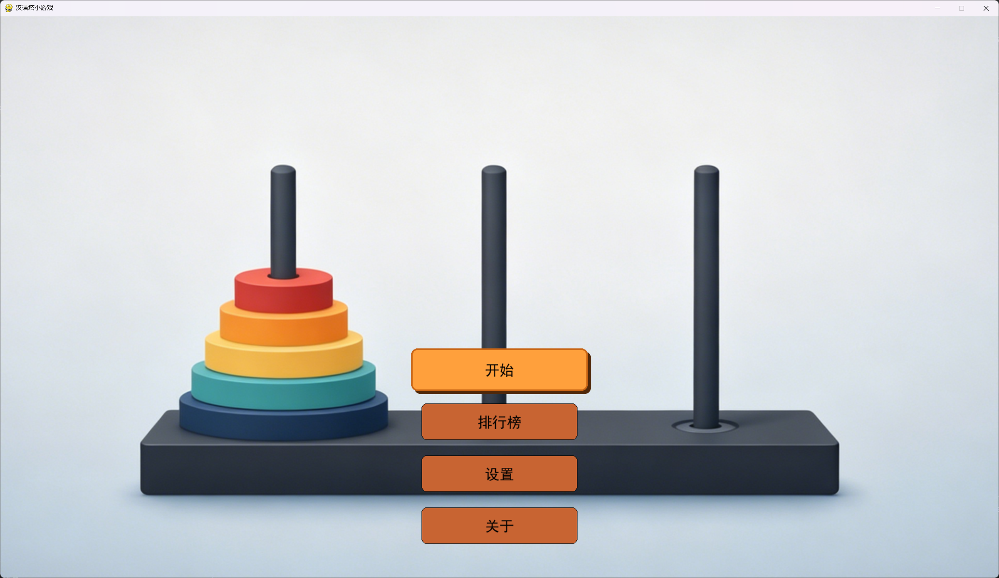
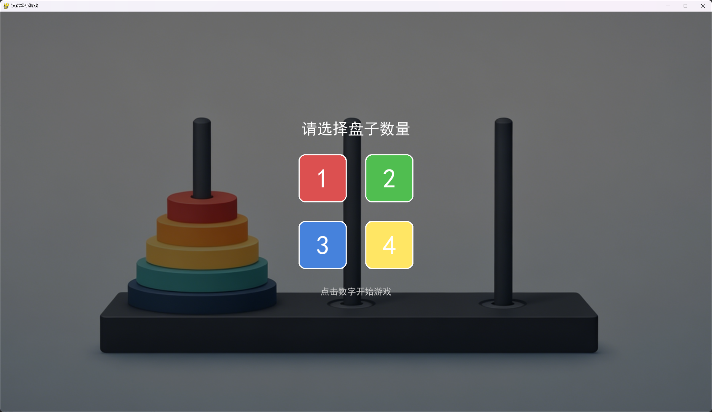
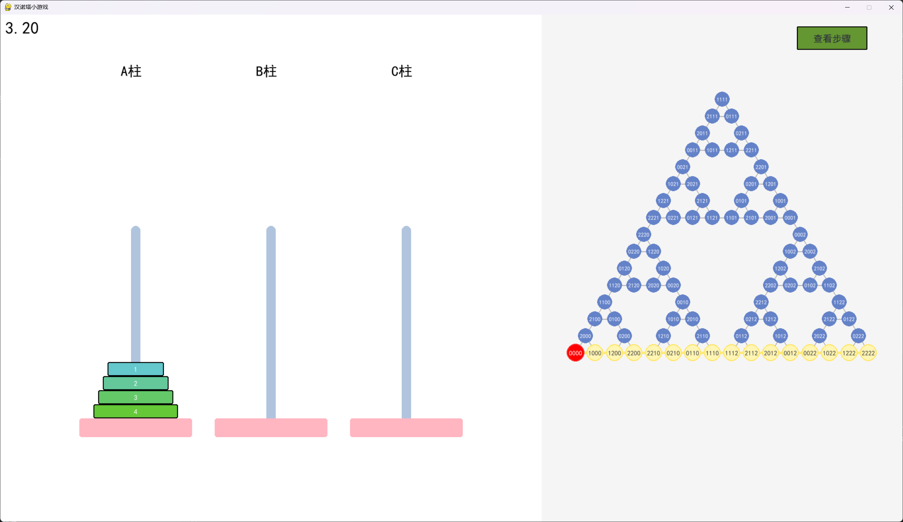
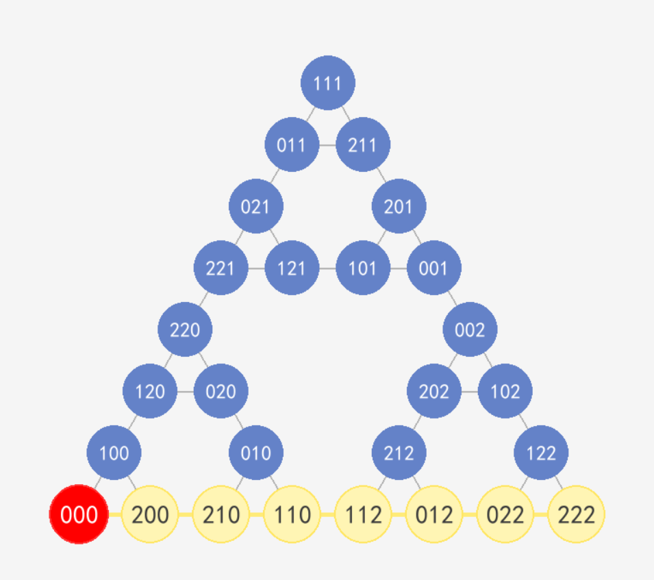

# 🏯 可视化汉诺塔

**菜单界面**



**选择盘子数量界面**



**游玩界面**



> 左侧为经典的汉诺塔三柱游戏，右侧实时绘制其对应的**谢尔宾斯基三角形**状态图。
> 关于这一数据结构的详细解释，请见下文[谢尔宾斯基三角形与汉诺塔](#-谢尔宾斯基三角形与汉诺塔)一节。

## 📦 下载与安装

### 获取工程

#### 方式一：Git Clone（推荐）

```bash
git clone https://github.com/weijianluo114-ux/hanoi_VISUALIZATION.git
cd hanoi_VISUALIZATION
```

#### 方式二：下载压缩包

前往 [GitHub 仓库页面](https://github.com/weijianluo114-ux/hanoi_VISUALIZATION) 点击绿色的 **Code** → **Download ZIP**，解压后进入 `hanoi-VISUALISATION` 文件夹即可。

### 安装依赖

确保已安装 Python 3.x，然后安装 Pygame：

```bash
pip install pygame
```

### 使用 Conda 创建虚拟环境（可选）

```bash
conda create -n hanoi_visualization python=3.10 -y
conda activate hanoi_visualization
pip install -r requirements.txt
```

## 🎮 如何游玩

工程使用 Python 的模块化结构，需要通过 `python -m` 方式运行。

### Windows

```bash
cd hanoi-VISUALISATION
python -m src.ui.main
```

### Linux / macOS

```bash
cd hanoi-VISUALISATION
python3 -m src.ui.main
```

### 游戏操作

| 按键                  | 功能                            |
| --------------------- | ------------------------------- |
| `1` / `2` / `3` | 选中第 1/2/3 根柱子             |
| `Space`             | 拿起/放下当前选中柱子顶部的盘子 |
| `ESC`               | 返回主菜单                      |

---

## 📁 项目结构

```
hanoi-VISUALISATION/
├── assets/                          # 资源文件（图片、音乐）
└── src/
    ├── __init__.py
    ├── solution/
    │   ├── __init__.py
    │   └── solution_m.py           # 汉诺塔递归求解算法
    ├── ui/
    │   ├── __init__.py
    │   ├── main.py                 # 程序入口 & 主循环
    │   ├── components/
    │   │   ├── __init__.py
    │   │   ├── disk_m.py           # 盘子组件
    │   │   ├── tower_m.py          # 柱子组件
    │   │   └── get_graph.py        # 状态图生成（邻接表 + 谢尔宾斯基定位）
    │   └── states/
    │       ├── __init__.py
    │       ├── menu.py             # 主菜单界面
    │       ├── select_disks.py     # 选择盘子数量界面
    │       ├── gameplay.py         # 游戏游玩界面
    │       ├── win.py              # 胜利界面
    │       ├── settings.py         # 设置界面
    │       ├── leaderboard.py      # 排行榜界面
    │       └── about.py            # 关于界面
    └── utils/                      # 工具模块

```

### 技术栈

- **Python 3.x** — 开发语言
- **Pygame** — 图形界面与游戏引擎
- 纯递归算法计算最优解与状态图

---

## 🔺 谢尔宾斯基三角形与汉诺塔

### 什么是谢尔宾斯基三角形？

**谢尔宾斯基三角形**（Sierpinski triangle）是一种经典的分形结构，由波兰数学家瓦茨瓦夫·谢尔宾斯基于1915年提出。其构造方式如下：

1. 从一个实心正三角形开始
2. 连接三条边的中点，去掉中间的小三角形
3. 对剩下的三个小三角形重复上述步骤

无限迭代下去，就得到了谢尔宾斯基三角形——一个具有**自相似性**的几何图形，整体与局部在形态上相似。

### 汉诺塔的状态编码

本工程中，n 个盘子（从最小到最大编号为 0 到 n-1）的状态用一个 n 元组表示：

```
state = (d₀, d₁, d₂, ..., dₙ₋₁)
```

其中每个 $d_i \in \{0, 1, 2\}$ 表示第 i 号盘子所在的柱子编号（0=A柱，1=B柱，2=C柱）。

例如，3 个盘子全部在 A 柱上表示为 `(0, 0, 0)`，全部在 C 柱上表示为 `(2, 2, 2)`。

### 神奇的对应关系

汉诺塔的**所有合法状态**恰好可以一一映射到谢尔宾斯基三角形的**所有小三角形重心位置**上。具体来说：

- 将谢尔宾斯基三角形的三个顶点分别对应三根柱子（A、B、C）
- 从最大的盘子开始，递归地细分三角形：每个盘子所处的柱子决定了进入哪一层的子三角形
- 经过 n 次细分后，最终落在的小三角形的重心位置就是该状态在状态图中的坐标

**令人惊叹的是**：汉诺塔的所有 $3^n$ 种状态天然地排列成一个谢尔宾斯基三角形！相邻状态（可通过一次合法移动互相到达）在图中恰好由一条边相连。这意味着：

- 状态图中所有顶点和边构成的图形**就是**一个谢尔宾斯基三角形
- 从当前状态到目标状态的最短路径，在图中就是一条沿着边行走的折线

这一奇妙对应关系之所以成立，根本原因是汉诺塔和谢尔宾斯基三角形都源自**递归**的数学结构——汉诺塔的最优解法本身就是递归的，而谢尔宾斯基三角形也是递归生成的。

> **工程实现**：本程序在每次玩家移动盘子后，自动使用 **BFS（广度优先搜索）** 算法实时计算从当前状态到目标状态（全在 C 柱）的最短路径，并在右侧谢尔宾斯基三角形状态图上以**黄色高亮**绘制整条路径，帮助玩家直观地规划后续步骤。



> 上图中的三角形网络就是谢尔宾斯基三角形状态图，每个节点代表一种盘子布局，黄色路径展示了从当前状态到目标状态的最短路线。

### 参考文献

[汉诺塔杂谈（二）——汉诺塔图 - 知乎](https://zhuanlan.zhihu.com/p/36090187)

---

## 📜 关于

本项目为 **数据结构** 课程作业。

由 **中山大学 集成电路学院 23362067 同学** 制作。

---

## 📄 许可证

本项目基于 MIT 许可证开源，详见 LICENSE 文件。
